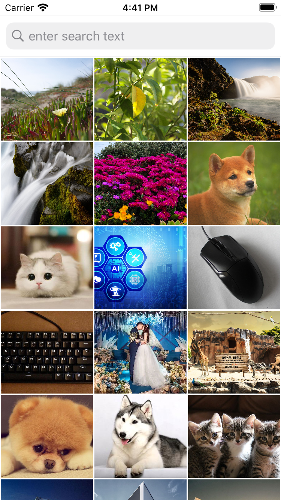

# A Mobile Text-to-Image Search Powered by AI
A minimal demo demonstrating semantic multimodal text-to-image search using pretrained vision-language models. Semantic search represents each sample(text and image) as a vector in a shared semantic embedding space. The relevance score can then be measured as similarity(cosine similarity or distance) between vectors.

# News!
1. Transplanted Spotify's [Annoy](https://github.com/spotify/annoy) Approximate Nearest Neighbor search in this project.
2. Experiment of distilling CLIP ViT-32/B(350+MB) into a much smaller one(40MB+) is on going.

# Features
1. text-to-image retrieval using semantic similarity search.
2. support different vector indexing strategies(linear scan, KMeans, and random projection).

# Screenshot
+ All images in the gallery  
+ Search with query **Three cats** 

# Install
1. Download the two TorchScript model files([text encoder](https://drive.google.com/file/d/1583IT_K9cCkeHfrmuTpMbImbS5qB8SA1/view?usp=sharing), [image encoder](https://drive.google.com/file/d/1K2wIyTuSWLTKBXzUlyTEsa4xXLNDuI7P/view?usp=sharing)) into models folder and add them into the Xcode project.
2. Required dependencies are defined in the Podfile. We use Cocapods to manage these dependencies. Simply do 'pod install' and then open the generated .xcworkspace project file in XCode.
```bash
pod install
```
3. This demo by default load all images in the local photo gallery on your realphone or simulator. One can change it to a specified album by setting the **albumName** variable in **getPhotos** method and replacing **assetResults** in line 117 of GalleryInteractor.swift with **photoAssets**.

# Todo
+ Basic features
- [x] Accessing to specified album or the whole photos
- [x] Asynchronous model loading and vectors computation
- [x] Export pretrinaed CLIP into TorchScript format using torch.jit.script and optimize_for_mobile provided by Pytorch
- [x] Transplant the original PIL based image preprocessing procedure into OpenCV based procedure, observed about 1% retrieval performance degradation
- [x] Transplant the CLIP tokenizer from Python into Swift(Tokenizer.swift) 
+ Indexing strategies
- [x] Linear indexing(persisted to file via built-in Data type)
- [x] KMeans indexing(persisted to file via NSMutableDictionary, hard-coded num of clusters, u can change to whatever u want)
- [x] Spotify's [Annoy](https://github.com/spotify/annoy) libraby with random projection indexing.
+ Choices of semantic representation models
- [x] OpenAI's CLIP model
- [ ] Integration of other multimodal retrieval models
+ Effiency
- [ ] Reducing memory consumption of models(ViT/B-32 version of CLIP takes about 605MB for storage and 1GB for runtime on iPhone)

# About us
This project is maintained by [ADAPT](http://adapt.seiee.sjtu.edu.cn/) lab from Shang Hai Jiao Tong University. We expect it to continually integrate more advanced features and better cross-modla search experience.
